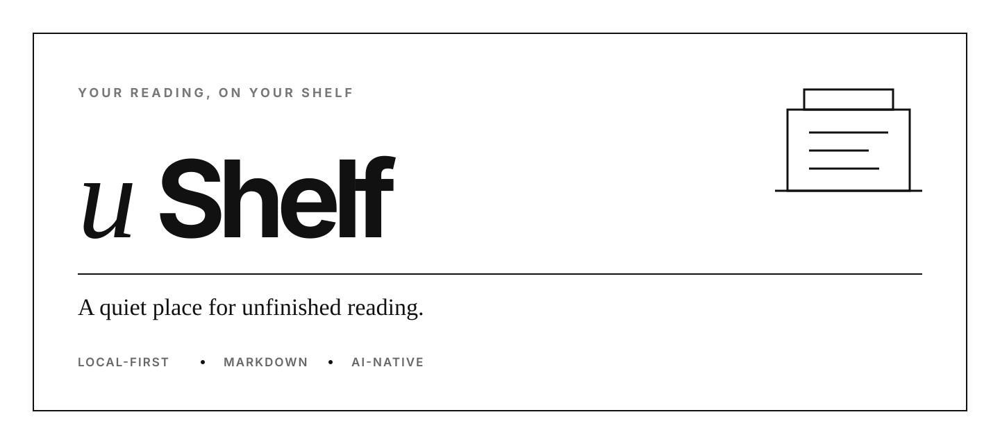
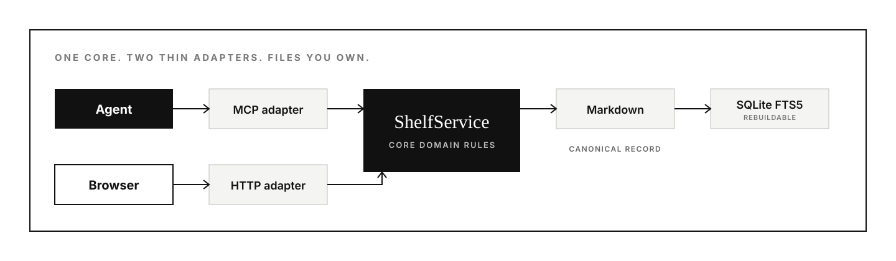

<p align="center">
  
</p>

<p align="center">
  <strong>A local, agent-native library for the writing worth keeping.</strong><br />
  Capture deterministically. Enrich with your agent. Keep everything as readable Markdown.
</p>

<p align="center">
  
  
  
  
  
</p>

## Why uShelf?

Most read-later tools own the database and bolt AI onto the side. uShelf takes the opposite approach:

- **Your files are the product.** Every completed item lives as portable, readable Markdown.
- **Your agent does the thinking.** uShelf exposes an MCP server and recipe-driven workflows, not a bundled model.
- **Capture stays deterministic.** Web sources are extracted, sanitized, normalized, and checked before enrichment begins.
- **The index is disposable.** SQLite FTS5 makes the library fast to search and can always be rebuilt from Markdown.
- **Reading is first-class.** The web reader tracks inbox, reading, read, and archived states, plus scroll progress.

> uShelf includes no model SDK, AI API key, embeddings store, or autonomous LLM process.

## How it works

<p align="center">
  
</p>

1. Ask your connected agent to save something from the web or attach a PDF.
2. uShelf captures and normalizes the source with deterministic code.
3. The agent follows a versioned recipe to add cited summaries, insights, and tags.
4. You search and read everything in the web app, while the canonical record stays in Markdown.

## Quick start

Install the native CLI on macOS or Linux. Docker must already be installed and running.

```sh
curl -fsSL https://github.com/karamouche/ushelf/releases/latest/download/install.sh | sh
```

Then check your installation and start uShelf:

```sh
ushelf doctor
ushelf start
```

Next, connect the agent client you use:

```sh
ushelf setup codex
# or: ushelf setup claude
# or: ushelf setup all
```

Open the reader at [http://127.0.0.1:43110](http://127.0.0.1:43110), or run `ushelf open`. You can now ask the connected agent to save a URL or an attached PDF. Your library, recipes, configuration, optional Kindle credential, and disposable index live under `~/.ushelf`.

Useful lifecycle commands:

```sh
ushelf status
ushelf logs --follow
ushelf stop
ushelf update
```

The CLI downloads a release-matched container image. Node.js, pnpm, a repository clone, and Docker Compose are not required for normal use.

uShelf automatically creates its configuration, library, recipes, state, and versioned agent assets under `~/.ushelf` when needed.

The installer supports macOS and Linux on amd64 and arm64; Windows users can run it under WSL.

### CLI reference

| Command                | Purpose                                                         |
| ---------------------- | --------------------------------------------------------------- |
| `ushelf start`         | Initialize local files and start or reconcile the reader/API    |
| `ushelf stop`          | Remove the managed container without deleting data              |
| `ushelf status`        | Show health, URL, version, image, and home                      |
| `ushelf logs`          | Read or follow managed service logs                             |
| `ushelf open`          | Open the reader in the system browser                           |
| `ushelf mcp`           | Run the foreground stdio MCP container                          |
| `ushelf setup CLIENT`  | Configure Codex, Claude Code, or both and link bundled skills   |
| `ushelf doctor`        | Check Docker, filesystem, port, image, recipe, and client setup |
| `ushelf update`        | Verify and install the latest CLI and matching image            |
| `ushelf rebuild-index` | Rebuild disposable SQLite state from Markdown                   |
| `ushelf import FILE`   | Import a validated Markdown item                                |
| `ushelf kindle`        | Connect, inspect, or disconnect Send to Kindle                  |
| `ushelf config`        | Inspect or update persistent configuration                      |
| `ushelf version`       | Show CLI build and runtime image information                    |

## Connect your agent

Configure Codex, Claude Code, or both. This registers `ushelf mcp` at user scope and links the bundled workflows into the client's personal skill directory.

```sh
ushelf setup codex
ushelf setup claude
# or: ushelf setup all
```

Use `ushelf setup <client> --print` to inspect the exact registration command without making changes.

If an existing `ushelf` MCP entry or skill path points somewhere else, setup stops without overwriting it. Inspect the conflict first, then rerun with `--force` only when you intend to replace it.

Then try:

```text
Save this URL to uShelf.
Search my uShelf for writing about local-first software.
Show me unread pieces tagged architecture.
Send the saved post about local-first software to my Kindle.
```

## Send a saved item to Kindle

Connect an Amazon account from the native CLI, then use **Send to Kindle** in any reader page or ask your connected agent to send an already-saved item:

```sh
ushelf kindle setup
ushelf kindle status
```

The CLI opens Amazon's sign-in page and stores the resulting device credential at `~/.ushelf/secrets/kindle.json` with owner-only permissions. The reader or agent generates a reflowable EPUB from the canonical saved source and its local images, resolves one registered device, and sends without retaining an Amazon cloud-library copy. Insights are not included. After a successful delivery, uShelf remembers that device in local state and selects it by default next time when it is still registered; an agent asks you to choose when several devices are available and no valid preference exists.

This integration is unofficial and uses Amazon's undocumented Send to Kindle protocol through [`cyrgim/stk`](https://github.com/cyrgim/stk). Amazon may change or disable it without notice. Disconnect it with `ushelf kindle disconnect`.

## What is included

| Layer            | What it does                                                                                                                 |
| ---------------- | ---------------------------------------------------------------------------------------------------------------------------- |
| **CLI**          | Native installation, Docker lifecycle, updates, maintenance, and agent-client setup                                          |
| **Core**         | URL safety, extraction, schemas, recipes, Markdown persistence, SQLite indexing, and all domain rules                        |
| **MCP**          | Ingestion, enrichment, search, reading state, Kindle delivery, refresh, re-enrichment, and confirmation-gated deletion tools |
| **HTTP server**  | A thin Hono API, production web hosting, index rebuilding, and Markdown import commands                                      |
| **Web reader**   | A responsive React library and reader with full-text search, filters, reading progress, and local Mermaid rendering          |
| **Agent skills** | Guided ingestion and library-management workflows that stay in sync with the MCP contract                                    |

Extraction includes Readability for articles, layout-aware PDF.js text and embedded-figure extraction for attached PDFs, local image capture, sanitization, response and redirect limits, and private-network protections. PDF extraction joins wrapped paragraphs and conservatively recovers headings, lists, and simple tables as Markdown. X sources use a limited public extraction path with an explicitly agent-supplied fallback. PDF attachments are limited to 10 MiB and must contain embedded text; remote PDF URLs, OCR, vector-diagram reconstruction, complex multi-column layouts, DOCX, and PPTX are not yet supported.

## Markdown at the core

| Path                         | Purpose                                               |
| ---------------------------- | ----------------------------------------------------- |
| `~/.ushelf/library/items/`   | Canonical current Markdown documents                  |
| `~/.ushelf/library/history/` | Archived enrichment revisions                         |
| `~/.ushelf/library/files/`   | Original PDFs and content-addressed item media        |
| `~/.ushelf/recipes/`         | Editable, hash-versioned agent instructions           |
| `~/.ushelf/state/ushelf.db`  | Rebuildable search index and transient workflow state |
| `~/.ushelf/secrets/`         | Owner-readable optional integration credentials       |

Markdown remains the source of truth. Canonical URLs deduplicate web ingestion, original-file hashes deduplicate PDF ingestion, content hashes detect source changes, recipe hashes identify stale enrichment, and revisions protect concurrent updates. If the index disappears, restore it with:

```sh
ushelf rebuild-index
```

To import an externally edited validated Markdown item, run:

```sh
ushelf import /absolute/path/to/item.md
```

Rendered images are downloaded into `library/files/<item-id>/media/` and referenced from canonical Markdown with portable relative paths. The reader serves only those validated local assets and never loads remote Markdown images. Retained PDFs can be opened from their document reader; embedded raster figures are extracted into the page-ordered Markdown, which remains the canonical searchable record.

## Run continuously with Docker Compose

The Compose setup builds the API and reader into one container, restarts after failures or reboots, and keeps canonical data on the host.

```sh
cp .env.example .env
printf 'USHELF_UID=%s\nUSHELF_GID=%s\n' "$(id -u)" "$(id -g)" >> .env
mkdir -p "$HOME/.ushelf/library/items" "$HOME/.ushelf/library/history" \
  "$HOME/.ushelf/recipes" "$HOME/.ushelf/state" "$HOME/.ushelf/secrets"
chmod 700 "$HOME/.ushelf/secrets"
test -f "$HOME/.ushelf/recipes/default.md" || \
  cp recipes/default.md "$HOME/.ushelf/recipes/default.md"
docker compose up -d --build
docker compose ps
```

Compose uses `~/.ushelf` by default, matching the native CLI and direct server or MCP processes. Configure Kindle credentials with `ushelf kindle setup`. To use another location, set an absolute `USHELF_ROOT` in `.env` and prepare the same directory layout there. The `.env` file itself is optional; when present, Compose loads it automatically. Set `USHELF_UID` and `USHELF_GID` to your host user and group IDs so the service and maintenance container can access the host-owned files.

The service binds to `127.0.0.1:43110` by default because uShelf does **not** provide HTTP authentication. For remote access, place an authenticated HTTPS proxy such as Caddy, Nginx, or Cloudflare Access in front of it, or use a VPN or SSH tunnel. Do not expose port `43110` directly to the public internet.

The image defaults to UID/GID `1000:1000` when used directly. Compose uses the IDs in `.env`, which avoids changing ownership of the host files.

Common operations:

```sh
docker compose logs -f ushelf
docker compose restart ushelf
docker compose down

git pull
docker compose up -d --build
```

To rebuild the disposable index against the same bind mounts:

```sh
docker compose stop ushelf
docker compose run --rm --no-deps maintenance rebuild-index
docker compose up -d
```

For a consistent backup, stop the service and copy `library/` and `recipes/`. SQLite state does not need to be backed up. Back up the root's `secrets/` directory separately only if you want to preserve optional integration credentials.

### Configuration

| Variable               | Default                 | Purpose                                                          |
| ---------------------- | ----------------------- | ---------------------------------------------------------------- |
| `USHELF_ROOT`          | `~/.ushelf`             | Root containing `library/`, `recipes/`, `state/`, and `secrets/` |
| `USHELF_STATE_DIR`     | `<USHELF_ROOT>/state`   | Optional override for disposable SQLite state                    |
| `USHELF_HOST`          | `127.0.0.1`             | Address published by the HTTP server or Compose                  |
| `USHELF_PORT`          | `43110`                 | HTTP port                                                        |
| `USHELF_WEB_BASE_PATH` | `/`                     | Root or subpath where the web app and API are served             |
| `USHELF_SECRETS_DIR`   | `<USHELF_ROOT>/secrets` | Optional override for integration credentials                    |

Without path overrides, host processes use `~/.ushelf` and keep `library/`, `recipes/`, `state/`, and `secrets/` directly beneath it. The service creates the writable directories it needs and seeds the bundled default recipe when it is missing. The `secrets/` directory remains optional until an integration is configured.

Set `USHELF_ROOT` to move the complete layout. Use `USHELF_STATE_DIR` or `USHELF_SECRETS_DIR` only when either directory must live outside that root. Containers use `/data` internally, backed by the selected host root.

The native CLI's `--home` flag overrides `USHELF_ROOT`. It also accepts `USHELF_IMAGE`. Use `ushelf config show` for effective values and `ushelf config set` for persistent host, port, base-path, or image overrides.

For a subpath deployment, use an absolute path such as `/reader/`. uShelf normalizes the trailing slash, and your reverse proxy must preserve the prefix.

## Repository map

```text
packages/core   Shared domain and storage layer
apps/cli        Native Cobra CLI and Docker lifecycle
apps/server     HTTP and CLI adapter
apps/mcp        stdio MCP adapter
apps/web        React and Vite reader
recipes         Versioned enrichment instructions
skills          Agent ingestion and library workflows
library         Canonical saved documents and history
```

Package-specific runtime notes live in the README inside each package.

## Development

Contributors need Node.js 24+, pnpm 11, Go 1.25+, and Docker.

```sh
git clone https://github.com/karamouche/ushelf.git
cd ushelf
pnpm install
cp .env.example .env
pnpm dev
```

```sh
pnpm typecheck
pnpm test
pnpm build
pnpm test:e2e
pnpm format:check
pnpm validate:skills
pnpm db:check
go -C apps/cli vet ./...
```

When changing the SQLite schema, edit the Drizzle schema in Core, run `pnpm db:generate --name=describe_the_change`, and review the checked-in SQL migration.

Run the smallest relevant check while iterating. Build before `pnpm test:e2e`, because Playwright launches the compiled production server.
The E2E command also performs live ingestion checks against the documented X and article fixtures, so it requires internet access and can fail when either upstream source is unavailable or changes its public metadata.

Contributions should preserve the central boundary: deterministic code captures and stores sources; a connected agent performs explicit, recipe-driven enrichment. See [CONTRIBUTING.md](CONTRIBUTING.md) for the contribution license terms.

## Releasing

Run the **Release** workflow manually with the desired semantic version. The workflow opens a `release/vMAJOR.MINOR.PATCH` pull request containing the project-version updates. Merging that pull request verifies the merged commit, creates its version tag, publishes the CLI archives and container image, and creates the GitHub Release. Do not create the release tag beforehand.

## License

uShelf is licensed under the [Apache License 2.0](LICENSE).
